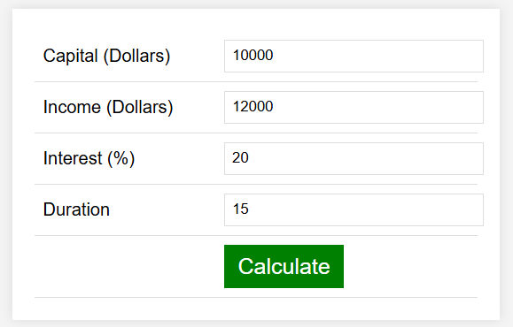

<div align="center">
   <h1> Interest Calculator </h1>
</div>

## Overview
The **Interest Calculator** is a web-based tool for calculating compound interest on an initial capital amount and fixed income over a specified duration. It is designed to help individuals or businesses understand the growth of their investments or savings over time using the power of compounding.

## What is Compound Interest?
Compound interest is the process where the interest earned on an investment is reinvested, generating additional interest over time. The formula for compound interest is:

```math
A = P \times \left(1 + \frac{r}{n}\right)^{n \times t}
```

Where:
- **A** is the future value of the investment/savings.
- **P** is the principal amount (initial capital).
- **r** is the annual interest rate (in decimal form).
- **n** is the number of times interest is compounded per year.
- **t** is the time the money is invested or borrowed for, in years.

This tool simplifies the process by calculating compound earnings month by month, considering both the initial capital and regular fixed income.

## Linear Growth vs Exponential Growth

<div align="center">
   
</div>

To better understand compound interest, it's helpful to compare it with linear growth. Linear growth adds a fixed amount over time, while exponential growth increases at an accelerating rate as interest compounds. In the graph below, you can see how exponential growth (green line) surpasses linear growth (blue line) over time.

## Features
- Simple user interface for inputting capital, income, interest rate, and duration.
- Displays a detailed month-by-month breakdown of compound earnings, fixed income, and total capital.
- Ideal for financial planning and understanding investment growth.

## Screenshots
### Input Form
Below is the input form where users enter the required values to calculate the compound interest:

<div align="center">
    
</div>

### Detailed Results Table
After clicking "Calculate," a detailed breakdown of the earnings and capital is displayed:

<div align="center">
    
</div>

## How to Use
1. Clone or download the repository.
2. Open the `index.html` file in your browser.
3. Fill in the following fields:
   - **Capital (Dollars):** The initial amount of money.
   - **Income (Dollars):** Fixed monthly income added to the investment.
   - **Interest (%):** Annual interest rate (in percentage).
   - **Duration:** The total investment duration in months.
4. Click the "Calculate" button to see the results.
5. View the detailed month-by-month breakdown of earnings and capital.

## Installation
No installation is required. This project is a single-page static HTML file. Simply open it in any modern web browser.

## Technologies Used
- **HTML5:** For structure and layout.
- **CSS:** For styling the form and table.
- **JavaScript:** For calculations and dynamic updates.

## Contributing
This project is not open for contributions. If you wish to make any additions or changes, please fork the repository and maintain the changes in your own repositories.

## License
This project is open-source and available under the [MIT License](LICENSE).

## Contact
For further inquiries or feedback, please contact the repository owner through the GitHub Issues page.

